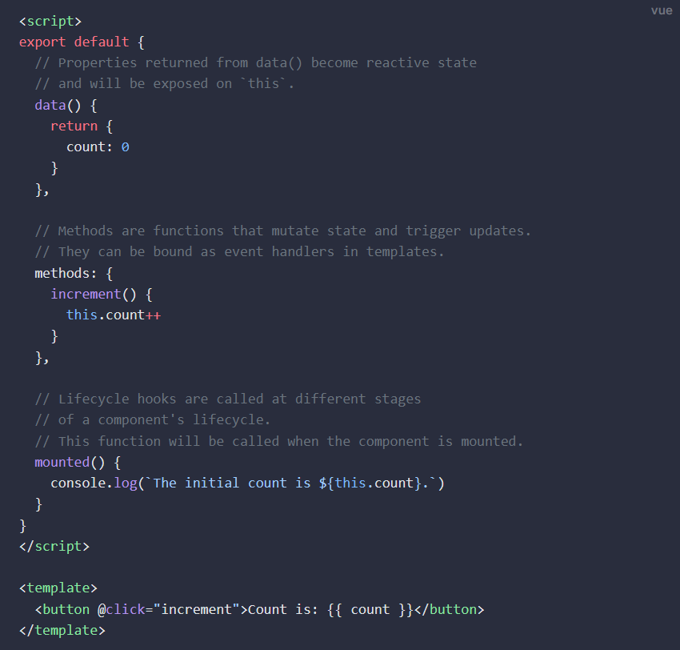
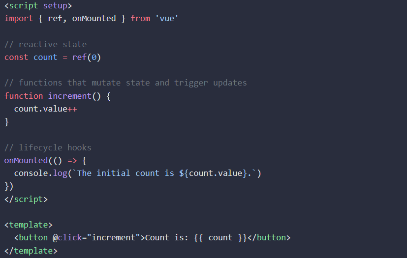

## Vuejs Component Lifecycle

## Vite
Vite is a build tool that takes care of code bundling, building, and hot-reloading.  You use it to create vuejs project.

npm init vue@latest

## Options vs Composition API Styles
Vue.js offers two primary ways of organizing and managing code: Options API and Composition API. Here's a comparison of the two:

### Options API
**Object-based Approach**: The Options API revolves around defining a Vue component as an object with various properties and methods, such as data, computed, methods, watch, etc.

**Separation of Concerns**: Options API provides a clear separation between different concerns of a component, such as data, computed properties, methods, and lifecycle hooks.

**Ease of Understanding**: It's relatively easier for beginners to understand and start with the Options API due to its more straightforward structure and familiarity with object-oriented programming concepts.

**Templates**: Options API often uses templates for the markup, where data from the component's properties and methods can be directly accessed and used.

**Limited Reusability**: While components built with Options API can be reused, there might be challenges in extracting and reusing logic across components, leading to potential code duplication.

### Composition API
It was introduced in vuejs 3.0. It is an umbrella term that covers the following APIs:
- Reactivity API e.g. ref() and reactive() allos us to directly create reactive state, computed state, and watchers.
- Lifecycle Hooks e.g. onMounted(), and onCreate() allows us to programatically hook into the component lifecycle.
- Dependency Injection e.g. provide(), and inject() allows to leverage vuejs dependency injection.

The major advantage with it is the code-sharability in a complex application where you want to share code between the components. 

**Function-based approach**: The Composition API allows composing component logic using functions. Instead of spreading component options across multiple object properties, logic can be organized into reusable functions.

**Composition of Concerns**: Composition API encourages composition of concerns, where related logic can be encapsulated into reusable functions, making it easier to manage complex components and share logic across different components.

**Reactivity and Composition**: Composition API leverages Vue's reactivity system to make the composition of reactive data and computed properties more flexible and intuitive.

**Code Organization**: With Composition API, you have more flexibility in organizing your code. You can group related logic together, making it easier to understand and maintain.

**Type Safety**: Composition API can provide better support for type safety and TypeScript integration due to its function-based nature, making it easier to maintain larger projects.

## Mixins to Composables
Mixins is used to re-use code in vuejs 2, and it also works in vuejs 3.0.

Composables in vuejs3 is used for code sharing. They are named with prefix "use".

