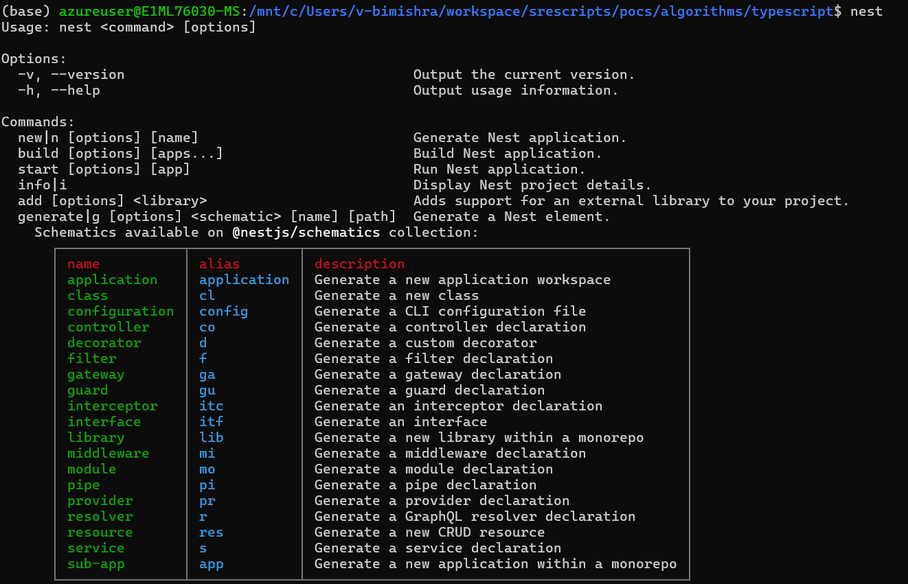

# NESTJS
**ExpressJS** is an **_unopinionated_** and **_minimalist_** web framework for Nodejs to build frontend and backend applications. By **_unopinionated_** means, it does not enforce any structure. 

**NestJS** is an **_opinionated_** web framework for Nodejs that follows the MVC design pattern. It is used for building large & scalable backend applications. It provides native supports for Microservices architectures like messaging patterns, caching, circuit braker, etc... **NestJS** also supports TypeScripts.

Under the hood, Nest make use of robus HTTP Server framework of Express and optionally it can be configured to use Fastify as well.

## Reference
```http
https://docs.nestjs.com/ 
```

---
## Environment Setup
```bash
# Pre-requisites
Install nodejs

# Install nestjs cli
$npm i -g @nestjs/cli 

# Optional: Need these packages for defining dto and validators or for data transformation when you receive requests
$npm i @nestjs/mapped-types - D

$npm i class-validator class-transformer 

nest -v
```



## Nest Commands
```bash
# Create application
$nest new <app_name>
$nest new lesson01

```

## Nest App Folder Structure

### Root Folder Files
    - main.ts: Entry point. Starts the Nest app. Like main() in other languages. It bootstraping is the process of setting up and starting your application — loading modules, initializing services, and preparing to handle requests.
    - app.module.ts: Root module that wires up all the parts of the app.
    - app.controller.ts: A sample controller that handles HTTP routes at the root.
    - app.service.ts: A sample service with some logic. (provider)
    - app.controller.spec.ts: 	Unit test for the controller (using Jest).

_Note_: 
    1. A Module in NestJS, is a way to organize related parts of your app — controllers, services, providers — into a cohesive block. It wires up the components controllers, services, and providers.

    2. A Provider is any class that can be injected using NestJS's Dependency Injection system — typically services, repositories, factories, helpers, or even config values. 

    3. A controller is a list of routes. Each route link to a provider performing specific action. 

    4. Dependency Injection (DI) is a design pattern where an object receives the dependencies it needs (like services or config) from the outside, rather than creating them itself. DI often uses the factory pattern behind the scenes.

## Add a Module, controller and provider
A Module in NestJS, is a way to organize related parts of your app — controllers, services, providers — into a cohesive block.

```bash
$ nest g module users  #It creates a new module called "Users" and its related codes.

$ nest g controller users #It creates the controller

$ nest g service users #It creates the provider
```
https://docs.nestjs.com/pipes

## Pipes
It is specific type of middleware for data validation or transformation. 

## DTO (Data Transfer Object or Schema)
 A DTO is an object that specifies how data should be sent over the network. We could define the DTO schema using TypeScript interfaces or simple classes.


## Run Code
```
# In Development, run the typescript code directly without compilling.
npx ts-node src/main.ts

## set this varaible for the watch to work in WSL
export CHOKIDAR_USEPOLLING=true

```

## Build dB App Demo
- Using prisma ORM

- Neon serverless postgress - https://neon.tech/ (use google login)

## Prisma
```
# set the DATABASE_URL environment variable to postgress connection string

```

```
# add prisma package to the project
npm i prisma -D

#Run this command in application folder to build the prisma schema file in the folder called prisma
npx prisma init

# Define your models within the ./prisma/schema.prisma file

# Run the command to create the schema in the db
npx prisma migrate dev --name init #first migration

npx prisma migrate dev --name change1 #incremental change migration

or 
npx prisma migrate push

##Rebuilds the Prisma Client that would include the model classes for the schema change you did. (this fixes the prisma issues also)
npx prisma generate

```

## Create Data Access Layer (Module Name: DAL)
In Nestjs, everything is module. so is the DAL. Let's create it
```
$nest g module db

$nest g service db

_Note: you must export out dal service from the module so that the other services can consume it
```

## Creating a new RestAPI service and all requires resources in one-go (instead of creating them one by one above)
```
$nest g resource employees #It prompts you whether you create RESTAPI, GraphQL, Microservice Non-HTTP, WebSockets...

It also creates dto and entities which we will not use. we will instead use the entities defined in prisma. So, we will delete the dto and entities file.

```

## Rate Limiting
```
npm i --save @nestjs/throttler
```

------------------------

# NestJS MVC Application with EJS and Tailwind CSS

This guide walks you through creating an MVC application using **NestJS**, **EJS** as the view engine, and **Tailwind CSS** for styling.

---

## ✅ Step 1: Create a New NestJS Project

If you haven't already:

```bash
nest new my-mvc-app
cd my-mvc-app
```

---

## ✅ Step 2: Enable MVC Mode & Configure EJS View Engine

1. **Install EJS**:

```bash
npm install ejs
```

2. **Update `main.ts`**:

```ts
import { NestFactory } from '@nestjs/core';
import { AppModule } from './app.module';
import { NestExpressApplication } from '@nestjs/platform-express';
import { join } from 'path';

async function bootstrap() {
  const app = await NestFactory.create<NestExpressApplication>(AppModule);

  app.setBaseViewsDir(join(__dirname, '..', 'views'));
  app.setViewEngine('ejs');

  app.useStaticAssets(join(__dirname, '..', 'public'));

  await app.listen(3000);
}
bootstrap();
```

3. **Create the `views` folder** at the root level and add an example file:

```html
<!-- views/index.ejs -->
<!DOCTYPE html>
<html lang="en">
<head>
  <meta charset="UTF-8">
  <title>My MVC App</title>
  <link href="/css/output.css" rel="stylesheet">
</head>
<body class="bg-gray-100 text-center">
  <h1 class="text-3xl font-bold text-blue-500">Hello from NestJS with EJS and Tailwind!</h1>
</body>
</html>
```

---

## ✅ Step 3: Create a Controller that Renders the View

```ts
// src/app.controller.ts
import { Controller, Get, Render } from '@nestjs/common';

@Controller()
export class AppController {
  @Get()
  @Render('index') // Looks for views/index.ejs
  root() {
    return { message: 'Welcome to NestJS MVC' };
  }
}
```

---

## ✅ Step 4: Add Tailwind CSS

1. **Install Tailwind and dependencies**:

```bash
npm install tailwindcss @tailwindcss/cli
#npx tailwindcss init -p
```

2. **Configure `tailwind.config.js`**:

```js
/** @type {import('tailwindcss').Config} */
module.exports = {
  content: ['./views/**/*.ejs'],
  theme: {
    extend: {},
  },
  plugins: [],
};
```

3. **Create Tailwind CSS input file**:

```css
/* public/css/input.css */
@tailwind base;
@tailwind components;
@tailwind utilities;
```

4. **Add Tailwind build script** in `package.json`:

```json
"scripts": {
  "build:css": "tailwindcss -i ./public/css/input.css -o ./public/css/output.css"
}
```

5. **Build Tailwind CSS output**:

```bash
npm run build:css
```

---

## ✅ Step 5: Run the App

1. In one terminal:

```bash
npm run start
```

2. In another terminal:

```bash
npm run build:css
```

Visit: [http://localhost:3000](http://localhost:3000)

---

Let me know if you want to add routing, layout partials, or connect a database next!


## Implementing Authentication and Authorization

```
npm install @azure/msal-node express-session @azure/identity
```


## Read Environment Variables
```
npm install @nestjs/config dotenv

npm install express-session @nestjs/platform-express
npm install cookie-parser
```

```js
import { Module } from '@nestjs/common';
import { ConfigModule } from '@nestjs/config';
import { AppService } from './app.service';
import { AppController } from './app.controller';

@Module({
  imports: [
    ConfigModule.forRoot({
      isGlobal: true, // Makes the configuration available globally across all modules
      envFilePath: '.env', // Path to your .env file (optional)
    }),
  ],
  controllers: [AppController],
  providers: [AppService],
})
export class AppModule {}

```


### Create an WebSocket Server Component
```

nest new boradcaster
cd boradcaster
npm install @nestjs/websockets @nestjs/platform-socket.io socket.io socket.io-client

install tailwind 

nest g module notifier
nest g gateway notifier


```

```js
import {
  WebSocketGateway,
  WebSocketServer,
  OnGatewayInit,
} from '@nestjs/websockets';
import { Server } from 'socket.io';
import { Injectable, Logger, OnModuleInit } from '@nestjs/common';

@WebSocketGateway()
@Injectable()
export class StocksGateway implements OnGatewayInit, OnModuleInit {
  @WebSocketServer()
  server: Server;

  private readonly logger = new Logger(StocksGateway.name);

  onGatewayInit() {
    this.logger.log('WebSocket Gateway initialized');
  }

  onModuleInit() {
    this.logger.log('StocksGateway module initialized');
    this.startSendingStockData();
  }

  private startSendingStockData() {
    setInterval(() => {
      const dowJones = this.getMockIndexValue('DOWJONES');
      const sp500 = this.getMockIndexValue('SP500');

      const data = {
        timestamp: new Date(),
        dowJones,
        sp500,
      };

      this.server.emit('stockUpdate', data);
      this.logger.debug(`Emitted stock update: ${JSON.stringify(data)}`);
    }, 30000); // every 30 seconds
  }

  private getMockIndexValue(index: string): number {
    const base = index === 'DOWJONES' ? 38000 : 5000;
    return +(base + Math.random() * 200 - 100).toFixed(2);
  }
}

```